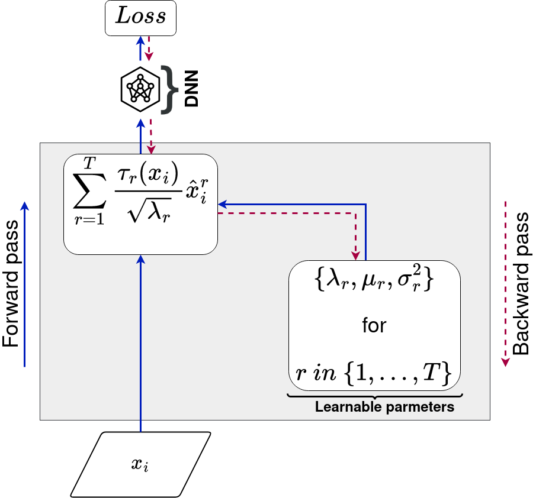
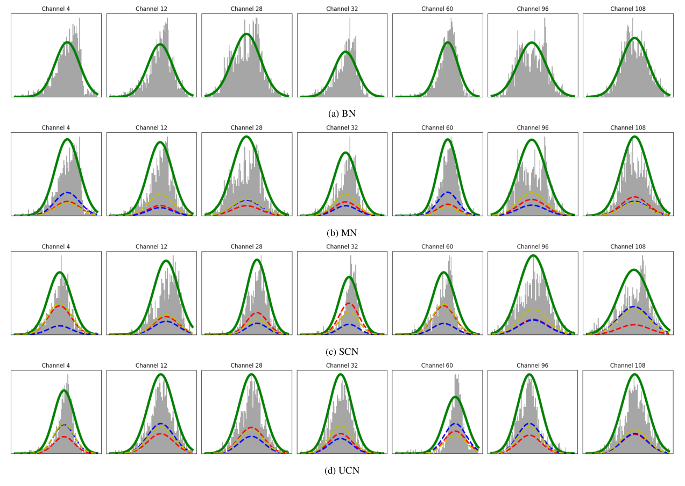
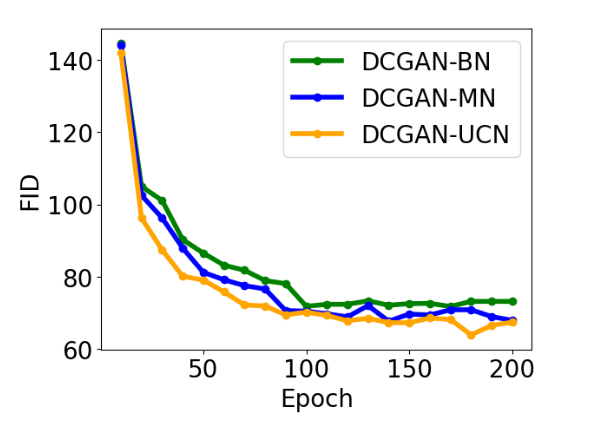

# 
**Unsupervised Context Normalization**

This repository is an official implementation and applications of UCN: Unsupervised Context Normalization.

## Introduction

UCN (Unsupervised Context Normalization) introduces a pioneering technique within neural networks, utilizing context-driven data grouping to achieve quicker convergence and enhanced performance. This sets it apart from conventional methods such as Batch Normalization and Mixture Normalization.

<bold>Figure:</bold> Unsupervised Context Normalization Layer, applied on a given activation. The parameters (&lambda;r, &mu;r, &Sigma;r) are learned during backpropagation.
 

**Abstract.** Deep neural networks are increasingly employed across various fields, showcasing remarkable results in solving highly complex problems, particularly in Natural Language Processing (NLP) and computer vision. Despite their performance, the training of deep neural networks remains challenging, necessitating strategies to address these issues. One significant challenge contributing to the complexity of learning is the shift in activation distributions between layers, attributed to weight updates during backpropagation, leading to unstable gradients and slow convergence. To mitigate the distribution shift problem, Batch Normalization (BN) was introduced. BN normalizes activations to achieve zero mean and unit variance, resolving the "Internal Covariate Shift" issue and allowing the use of a higher learning rate to expedite neural network convergence.
However, BN has notable limitations: its performance depends on mini-batch size, and it relies on the naive assumption that samples within the mini-batch are from the same distribution. To address mini-batch dependency, methods like Layer Normalization (LN), Instance Normalization (IN), and Group Normalization (GN) have been proposed. To overcome the naive distribution assumption, Mixture Normalization (MN) was introduced, assuming that data follows a Gaussian mixture model. MN involves a two-step normalization process: (i) employing the Expectation-Maximisation (EM) algorithm to find parameters for each mixture component, and (ii) normalizing subsequent samples based on these components, with samples from the same component normalized using the same parameters. While effective, MN incurs high computational costs due to the EM algorithm and provides normalization that is independent of the target task, as parameters are fixed and calculated based on input data rather than activations.
To address these issues, we propose a novel normalization method called unsupervised context normalization (UCN). Unlike mixture normalization, UCN operates in a single step. The approach begins by assuming the existence of a structure called context, enabling the coherent grouping of samples with similar characteristics. The objective is to find a latent space where these contexts follow Gaussian distributions. This space is obtained by normalizing samples from the same context using parameters learned during the backpropagation phase. In addition to eliminating the need for the EM algorithm to find mixture component parameters, this approach adapts data representation according to the target task, as parameters are learned via backpropagation. The effectiveness of this normalization method is demonstrated across a range of applications, including classification, image generation with Generative Adversarial Networks (GANs), and domain adaptation.

## Applications

UCN (Unsupervised Context Normalization) can be used as a layer, it is compatible with Convolutional Neural Network (CNN) architecture, and can be applied at any network level.

UCN layer is available in the "normalization" directory.

In this repository, we provide three experiments with UCN on **classification** (using shallow and deep neural networks), Generative Adversial Networks (GANs), and domain adaptation:

* A Comparative Study: Unsupervise Context Normalization vs.
Mixture Normalization using Shallow Convolutional Neural Network.

* A comparative Study: Unsupervised Context Normalization vs. Mixiture Normalization using Deep Convolutional Neural Network.

* Unsupervised Context Normalization in GAN 

* Unsupervised Context Normalization in Domain Adaptation

The experiments conducted in this study utilize several commonly used benchmark datasets in the classification community, including:

| Dataset               | Link                                  
|-----------------------|---------------------------------------
| CIFAR-10              | [CIFAR-10 Link](https://www.cs.toronto.edu/~kriz/cifar.html)     |
| CIFAR-100             | [CIFAR-100 Link](https://www.cs.toronto.edu/~kriz/cifar.html)    
| Tiny ImageNet         | [Tiny ImageNet Link](https://www.kaggle.com/c/tiny-imagenet) 
| MNIST digits          | [MNIST Link](https://yann.lecun.com/exdb/mnist/)         
| SVHN                  | [SVHN Link](http://ufldl.stanford.edu/housenumbers/)         

## Results 
### 
 A Comparative Study: Unsupervise Context Normalization vs. Mixture Normalization using Shallow Convolutional Neural Network.

In this experiment, we use a shallow CNN in architectures in Mixture Normalization [paper](https://arxiv.org/abs/1806.02892).

**Evolution of accuracy (%) on CIFAR-10**
| Model      | Learning Rate | 25 Epochs | 50 Epochs | 75 Epochs | 100 Epochs |
|------------|---------------|-----------|-----------|-----------|------------|
| BN-1       | 0.001         | 84.34     | 86.49     | 86.41     | 86.90      |
| BN-2       | 0.005         | 83.44     | 84.39     | 85.65     | 85.65      |
| MN-1       | 0.001         | 84.45     | 86.60     | 86.6      | 87.07      |
| MN-2       | 0.005         | 83.47     | 84.60     | 85.68     | 85.80      |
| UCN-1 | 0.001         | 85.15      | 85.80     | 87.97     | 87.97      |
| ACN-2 | 0.005         | 86.04     | 86.04    | 87.49     | 87.49      |

**Evolution of accuracy (%) on CIFAR-100**
| Model      | Learning Rate | 25 Epochs | 50 Epochs | 75 Epochs | 100 Epochs |
|------------|---------------|-----------|-----------|-----------|------------|
| BN-1       | 0.001         | 57.41     | 59.74     | 59.82     | 59.82      |
| BN-2       | 0.005         | 55.64     | 56.97     | 56.29     | 56.29      |
| MN-1       | 0.001         | 56.90     | 59.80     | 59.80     | 60.10      |
| MN-2       | 0.005         | 55.80     | 55.80     | 56.56     | 57.09      |
| UCN-1 | 0.001         | 59.44     | 61.10     | 61.10     | 61.10      |
| UCN-2 | 0.005         | 58.31     | 60.29     | 60.29     | 60.29      |

**Evolution of accuracy (%) on Tiny ImaageNet**
| Model      | Learning Rate | 25 Epochs | 50 Epochs | 75 Epochs | 100 Epochs |
|------------|---------------|-----------|-----------|-----------|------------|
| BN-1       | 0.001         | 37.17     | 37.17     | 37.17     | 37.17      |
| BN-2       | 0.005         | 34.11     | 34.11     | 34.11     | 34.11      |
| MN-1       | 0.001         | 38.18     | 38.17     | 38.5      | 38.5       |
| MN-2       | 0.005         | 34.56     | 34.99     | 35.12     | 35.27      |
| UCN-1 | 0.001         | 39.71     | 39.71     | 39.71     | 39.71      |
| UCN-2 | 0.005         | 35.78     | 37.03     | 37.03     | 37.03      |

Figure: Visualizing Context Normalization in a Shallow CNN's 'conv2' layer on CIFAR-100 with a randomly selected mini-batch, showcasing activation distribution among 128 channels using a probability density function (solid green curve) and distinct mixture components (dashed curves).

### 
 A Comparative Study: Unsupervise Context Normalization vs. Mixture Normalization using Deep Convolutional Neural Network.

In this experiment, we use a Deep Convolutional Neural Network (DenseNet), with two versions: DenseNet-40 and DenseNet-100.

**Performance validation (%) on CIFAR-100 test set using DenseNet-40**
| Model         | Loss          | Accuracy  | Precision | Recall | F1-score   |
|------------   |---------------|-----------|-----------|--------|------------|
|DenseNet-40+BN | 1.7437        | 61.28     | 68.76     | 57.38  |   61.47    |
|DenseNet-40+MN | 1.5560        | 62.11     | 70.13     | 59.11  |   62.10    |
|DenseNet-40+UCN| 1.5369        | 63.21     | 71.58     | 59.21  |   63.29    |

**Performance validation (%) on CIFAR-100 test set using DenseNet-100**
| Model         | Loss          | Accuracy  | Precision | Recall | F1-score   |
|------------   |---------------|-----------|-----------|--------|------------|
|DenseNet-40+BN | 1.9225        | 69.16     | 71.57     | 68.34  |   69.28    |
|DenseNet-40+MN | 1.9010        | 69.50     | 71.80     | 68.40  |   69.57    |
|DenseNet-40+UCN| 1.8932        | 69.65     | 71.83     | 68.55  |   69.82    |

### 
 **Unsupervised Context Normalization in GAN** 

In this study, we utilize a DCGAN architecture as the baseline. The Batch Normalization layers in the generator are successively replaced by a Mixture Normalization layer and subsequently by our proposed normalization method, Unsupervised Context Normalization.

Figure: Frechet Inception Distance evolution.

### 
**Unsupervised Context Normalization in Domain Adaptation**

To apply ACN coherently, we implement unsupervised domain adaptation using [AdaMatch](https://keras.io/examples/vision/adamatch/). In this scenario, the source domain is MNIST, and the target domain is SVHN.

**MNIST (source domain)**
| Model                 | Accuracy  | Precision  | Recall  | F1-Score  |
|------------------------|-----------|------------|---------|-----------|
| AdaMatch              | 97.36     | 87.33      | 79.39   | 78.09     |
| AdaMatch+UCN    | **98.9** | **98.5**  | **98.90** | **98.95** |

**SVHN (target domain)**
| Model                 | Accuracy  | Precision  | Recall  | F1-Score  |
|------------------------|-----------|------------|---------|-----------|
| AdaMatch              | 25.08     | 31.64      | 20.46   | 24.73     |
| AdaMatch+UCN    | 33.4     | 43.83      | 40.28   | 42.87     |