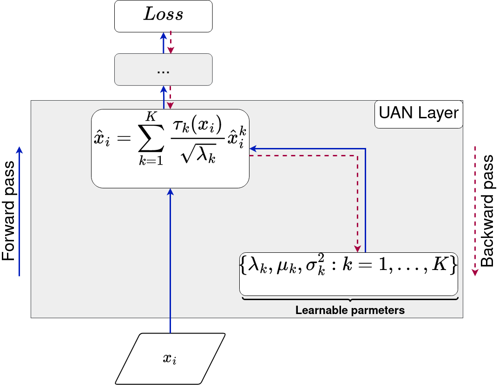
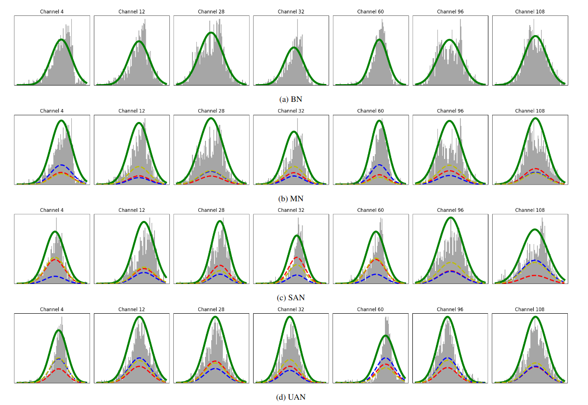
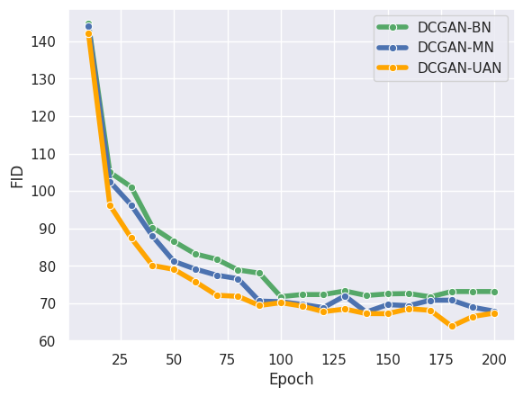

# <center>**Unsupervised Adaptive Normalization**</center>

This repository is an official implementation and applications of UAN: Unsupervised Adaptive Normalization.

## Paper Submitted to IJCNN 2024. Bilal FAYE et al.


## Introduction

UAN (Unsupervised Adaptive Normalization) introduces a pioneering technique within neural networks, utilizing cluster-driven data grouping to achieve quicker convergence and enhanced performance. This sets it apart from conventional methods such as Batch Normalization and Mixture Normalization.


<center><bold>Figure:</bold> Unsupervised Adaptive Normalization Layer, applied on a given activation. The parameters (&lambda;<sub>k</sub>, &mu;<sub>k</sub>, &Sigma;<sub>k</sub>) are learned during backpropagation.</center><br>

**Abstract.** Deep neural networks have become a staple in solving intricate problems, proving their mettle in a wide array of applications. However, their training process is often hampered by shifting activation distributions during backpropagation, resulting in unstable gradients. Batch Normalization (BN) addresses this issue by normalizing activations, which allows for the use of higher learning rates. Despite its benefits, BN is not without drawbacks, including its dependence on mini-batch size and the presumption of a uniform distribution of samples. To overcome this, several alternatives have been proposed, such as Layer Normalization, Group Normalization, and Mixture Normalization. These methods may still struggle to adapt to the dynamic distributions of neuron activations during the learning process. To bridge this gap, we introduce Unsupervised Adaptive Normalization (UAN), an innovative algorithm that seamlessly integrates clustering for normalization with deep neural network learning in a singular process.
UAN executes clustering using gaussian mixture model, determining parameters for each identified cluster, by normalizing neuron activations. These parameters are concurrently updated as weights in the deep neural network, aligning with the specific requirements of the target task during backpropagation. This unified approach of clustering and normalization, underpinned by neuron activation normalization, fosters an adaptive data representation that is specifically tailored to the target task. This adaptive feature of UAN enhances gradient stability, resulting in faster learning and augmented neural network performance.
UAN outperforms the classical methods by adapting to the target task and is effective in classification, image generation with GANs, and domain adaptation.

## Applications

UAN (Unsupervised Adaptive Normalization) can be used as a layer, it is compatible with Convolutional Neural Network (CNN) architecture, and can be applied at any network level.

UAN layer is available in the "normalization" directory.

In this repository, we provide three experiments with UAN on **classification** (using shallow and deep neural networks), Generative Adversial Networks (GANs), and domain adaptation:

* A Comparative Study: Unsupervised Adaptive Normalization vs.
Mixture Normalization using Shallow Convolutional Neural Network.

* A comparative Study: Unsupervised Adaptive Normalization vs. Mixiture Normalization using Deep Convolutional Neural Network.

* Unsupervised Adaptive Normalization in GAN<br>

* Unsupervised Adaptive Normalization in Domain Adaptation

The experiments conducted in this study utilize several commonly used benchmark datasets in the classification community, including:

<center>

| Dataset               | Link                                  
|-----------------------|---------------------------------------
| CIFAR-10              | [CIFAR-10 Link](https://www.cs.toronto.edu/~kriz/cifar.html)     |
| CIFAR-100             | [CIFAR-100 Link](https://www.cs.toronto.edu/~kriz/cifar.html)    
| Tiny ImageNet         | [Tiny ImageNet Link](https://www.kaggle.com/c/tiny-imagenet) 
| MNIST digits          | [MNIST Link](https://yann.lecun.com/exdb/mnist/)         
| SVHN                  | [SVHN Link](http://ufldl.stanford.edu/housenumbers/)         

</center>

## Results 
### <center> A Comparative Study: Unsupervised Adaptive Normalization vs. Mixture Normalization using Shallow Convolutional Neural Network.</center>

In this experiment, we use a shallow CNN in architectures in Mixture Normalization [paper](https://arxiv.org/abs/1806.02892).

<center>

**Evolution of accuracy (%) on CIFAR-10** 

| Model      | Learning Rate | 25 Epochs | 50 Epochs | 75 Epochs | 100 Epochs |
|------------|---------------|-----------|-----------|-----------|------------|
| BN-1       | 0.001         | 84.34     | 86.49     | 86.41     | 86.90      |
| BN-2       | 0.005         | 83.44     | 84.39     | 85.65     | 85.65      |
| MN-1       | 0.001         | 84.45     | 86.60     | 86.6      | 87.07      |
| MN-2       | 0.005         | 83.47     | 84.60     | 85.68     | 85.80      |
| UAN-1 | 0.001         | 85.15      | 85.80     | 87.97     | 87.97      |
| UAN-2 | 0.005         | 86.04     | 86.04    | 87.49     | 87.49      |


**Evolution of accuracy (%) on CIFAR-100**
| Model      | Learning Rate | 25 Epochs | 50 Epochs | 75 Epochs | 100 Epochs |
|------------|---------------|-----------|-----------|-----------|------------|
| BN-1       | 0.001         | 57.41     | 59.74     | 59.82     | 59.82      |
| BN-2       | 0.005         | 55.64     | 56.97     | 56.29     | 56.29      |
| MN-1       | 0.001         | 56.90     | 59.80     | 59.80     | 60.10      |
| MN-2       | 0.005         | 55.80     | 55.80     | 56.56     | 57.09      |
| UAN-1 | 0.001         | 59.44     | 61.10     | 61.10     | 61.10      |
| UAN-2 | 0.005         | 58.31     | 60.29     | 60.29     | 60.29      |


**Evolution of accuracy (%) on Tiny ImaageNet**
| Model      | Learning Rate | 25 Epochs | 50 Epochs | 75 Epochs | 100 Epochs |
|------------|---------------|-----------|-----------|-----------|------------|
| BN-1       | 0.001         | 37.17     | 37.17     | 37.17     | 37.17      |
| BN-2       | 0.005         | 34.11     | 34.11     | 34.11     | 34.11      |
| MN-1       | 0.001         | 38.18     | 38.17     | 38.5      | 38.5       |
| MN-2       | 0.005         | 34.56     | 34.99     | 35.12     | 35.27      |
| UAN-1 | 0.001         | 39.71     | 39.71     | 39.71     | 39.71      |
| UAN-2 | 0.005         | 35.78     | 37.03     | 37.03     | 37.03      |



<center>Figure: Visualizing Adaptive Normalization in a Shallow CNN's 'conv2' layer on CIFAR-100 with a randomly selected mini-batch, showcasing activation distribution among 128 channels using a probability density function (solid green curve) and distinct mixture components (dashed curves).</center>


### <center> A Comparative Study: Unsupervised Adaptive Normalization vs. Mixture Normalization using Deep Convolutional Neural Network.</center>
In this experiment, we use a Deep Convolutional Neural Network (DenseNet), with two versions: DenseNet-40 and DenseNet-100.

**Performance validation (%) on CIFAR-100 test set using DenseNet-40**
| Model         | Loss          | Accuracy  | Precision | Recall | F1-score   |
|------------   |---------------|-----------|-----------|--------|------------|
|DenseNet-40+BN | 1.7437        | 61.28     | 68.76     | 57.38  |   61.47    |
|DenseNet-40+MN | 1.5560        | 62.11     | 70.13     | 59.11  |   62.10    |
|DenseNet-40+UAN| 1.5369        | 63.21     | 71.58     | 59.21  |   63.29    |


**Performance validation (%) on CIFAR-100 test set using DenseNet-100**
| Model         | Loss          | Accuracy  | Precision | Recall | F1-score   |
|------------   |---------------|-----------|-----------|--------|------------|
|DenseNet-40+BN | 1.9225        | 69.16     | 71.57     | 68.34  |   69.28    |
|DenseNet-40+MN | 1.9010        | 69.50     | 71.80     | 68.40  |   69.57    |
|DenseNet-40+UAN| 1.8932        | 69.65     | 71.83     | 68.55  |   69.82    |


### <center> **Unsupervised Adaptive Normalization in GAN** </center>

In this study, we utilize a DCGAN architecture as the baseline. The Batch Normalization layers in the generator are successively replaced by a Mixture Normalization layer and subsequently by our proposed normalization method, Unsupervised Adaptive Normalization.

<center>Figure: Frechet Inception Distance evolution.</center>

### <center>**Unsupervised Adaptive Normalization in Domain Adaptation**</center>

To apply UAN coherently, we implement unsupervised domain adaptation using [AdaMatch](https://keras.io/examples/vision/adamatch/). In this scenario, the source domain is MNIST, and the target domain is SVHN.

**MNIST (source domain)**
| Model                 | Accuracy  | Precision  | Recall  | F1-Score  |
|------------------------|-----------|------------|---------|-----------|
| AdaMatch              | 97.36     | 87.33      | 79.39   | 78.09     |
| AdaMatch+UAN    | **98.9** | **98.5**  | **98.90** | **98.95** |


**SVHN (target domain)**
| Model                 | Accuracy  | Precision  | Recall  | F1-Score  |
|------------------------|-----------|------------|---------|-----------|
| AdaMatch              | 25.08     | 31.64      | 20.46   | 24.73     |
| AdaMatch+UAN    | 33.4     | 43.83      | 40.28   | 42.87     |

</center>


```bash
@inproceedings{faye2024unsupervised,
  title={UAN: Unsupervised Adaptive Normalization},
  author={Faye, Bilal and Azzag, Hanane and Lebbah, Mustapha and Feng, Fangchen},
  booktitle={International Joint Conference on Neural Networks (IJCNN)},
  year={2024}
}
```
